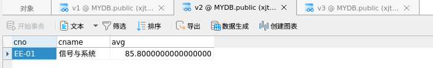

# 数据库实验


## 基础配置

### 1. 安装

下载openGauss极简版

根据[链接](https://opengauss.org/zh/docs/2.1.0/docs/installation/%E5%8D%95%E8%8A%82%E7%82%B9%E5%AE%89%E8%A3%85.html)进行安装（安装过程略）

### 2. 启动

在本机上启动openGauss服务

`gs_ctl start -D $GAUSSHOME/data/single_node -Z single_node`


### 3. 连接

#### 通过navicat连接

启动navicat软件


在navicat中连接数据库


#### 通过JDBC连接

在IDEA中配置项目，添加库文件


通过GetConnection函数连接

```java
    public static Connection GetConnection(String username, String passwd, String db, Integer port) {
        String driver = "org.postgresql.Driver";
        String sourceURL = String.format("jdbc:postgresql://localhost:%d/%s", port, db);
        Connection conn;
        try {

            Class.forName(driver);
        } catch (Exception e) {
            e.printStackTrace();
            return null;
        }

        try {
            //创建数据库连接。
            conn = DriverManager.getConnection(sourceURL, username, passwd);
            System.out.println("Connection succeed!");
        } catch (Exception e) {
            e.printStackTrace();
            return null;
        }

        return conn;
    }
```

    Jun 08, 2022 6:15:22 PM org.postgresql.core.v3.ConnectionFactoryImpl openConnectionImpl
    INFO: [a85e2185-e799-490e-9860-75368f40aaca] Try to connect. IP: localhost:5432
    Jun 08, 2022 6:15:22 PM org.postgresql.core.v3.ConnectionFactoryImpl openConnectionImpl
    INFO: [127.0.0.1:52572/ocalhost/127.0.0.1:5432] Connection is established. ID: a85...
    Jun 08, 2022 6:15:22 PM org.postgresql.core.v3.ConnectionFactoryImpl openConnectionImpl
    INFO: Connect complete. ID: a85...
    Connection succeed!

------

## 数据库基本操作

### 创建基本表

```sql
CREATE TABLE IF NOT EXISTS S249 
	(Sno Integer PRIMARY KEY, Sname VARCHAR(32), Sex Char(4), BDATE Date, Height Number, Dorm VARCHAR(32));
CREATE TABLE IF NOT EXISTS C249
	(Cno VARChar(16) PRIMARY KEY, Cname VARCHAR(32), Period Integer, Credit Float, Teacher VARCHAR(32));
CREATE TABLE IF NOT EXISTS SC249 
	(Sno Integer, Cno VARChar(16), Grade Number,
    PRIMARY KEY(Sno, Cno), Foreign Key(Sno) references S249(Sno), Foreign Key(Cno) references C249(Cno));
```

### 插入基础数据

```sql
INSERT INTO S249 VALUES
(1032010,'王涛','男','2002-4-5',1.72,'东14舍221'),
(1032023,'孙文','男','2003-6-10',1.8,'东14舍221'),
(1032001,'张晓梅','女','2003-11-17',1.58,'东1舍312'),
(1032005,'刘静','女','2002-1-10',1.63,'东1舍312'),
(1032112,'董蔚','男','2003-12-20',1.71,'东14舍221'),
(3031011,'王倩','女','2002-2-20',1.66,'东2舍104'),
(3031014,'赵思扬','男','2001-6-6',1.85,'东18舍421'),
(3031051,'周剑','男','2001-5-8',1.68,'东18舍422'),
(3031009,'田婷','女','2002-8-11',1.6,'东2舍104'),
(3031033,'蔡明明','男','2002-3-12',1.75,'东18舍423'),
(3031056,'曹子衿','女','2003-12-15',1.65,'东2舍305');

INSERT INTO C249 VALUES
('CS-01','数据结构',60,3,'张军'),
('CS-02','计算机组成原理',80,4,'王亚伟'),
('CS-04','人工智数据能',40,2,'李蕾'),
('CS-05','深度学习',40,2,'崔均'),
('EE-01','信号与系统',60,3,'张明'),
('EE-02','数字逻辑电路',100,5,'胡海东'),
('EE-03','光电子学与光子学',40,2,'石韬');

INSERT INTO SC249 VALUES
(1032010,'CS-01',82),
(1032010,'CS-02',91),
(1032010,'CS-04',83.5),
(1032001,'CS-01',77.5),
(1032001,'CS-02',85),
(1032001,'CS-04',83),
(1032005,'CS-01',62),
(1032005,'CS-02',77),
(1032005,'CS-04',82),
(1032023,'CS-01',55),
(1032023,'CS-02',81),
(1032023,'CS-04',76),
(1032112,'CS-01',88),
(1032112,'CS-02',91.5),
(1032112,'CS-04',86),
(1032112,'CS-05',NULL),
(3031033,'EE-01',93),
(3031033,'EE-02',89),
(3031009,'EE-01',88),
(3031009,'EE-02',78.5),
(3031011,'EE-01',91),
(3031011,'EE-02',86),
(3031051,'EE-01',78),
(3031051,'EE-02',58),
(3031014,'EE-01',79),
(3031014,'EE-02',71);
```

### 查询操作

```sql
-- 1
SELECT Cno, Cname FROM C249 WHERE Cno LIKE CONCAT('EE', '%');

-- 2
SELECT SC249.Sno, SC249.Cno, SC249.Grade FROM SC249 JOIN (SELECT S249.SNO FROM S249 WHERE Sex = '女') AS T
    ON SC249.Sno=T.Sno WHERE T.SNO NOT IN (SELECT Sno FROM SC249 WHERE Cno = 'CS-01');

-- 3
SELECT * FROM S249 WHERE Bdate BETWEEN '2000-01-01' and '2001-12-31';

-- 4
SELECT S249.Sno, S249.Sname, SUM(C249.Credit)
FROM S249 JOIN
    (SELECT * FROM SC249 WHERE Grade>=60 AND Grade IS NOT NULL) AS SC
ON S249.Sno=SC.Sno
JOIN C249 ON C249.Cno=SC.Cno
GROUP BY S249.Sno;

-- 5
-- SELECT Sno, Grade FROM SC249 WHERE Cno='CS-02'  ORDER BY Grade DESC LIMIT 1,1;
SELECT Sno, Grade FROM SC249 WHERE Cno='CS-02' AND Grade IN(
SELECT MAX(Grade) FROM SC249 WHERE Cno='CS-02' AND Grade !=
(SELECT MAX(Grade) FROM SC249 WHERE Cno='CS-02'))

```


```sql
-- 6 TODO: Need to be optimized 
SELECT Sno, Sname , AvgGrade FROM
    (SELECT SC.Sno Sno, S249.Sname Sname, AVG(SC.Grade) AvgGrade
    FROM S249 JOIN (SELECT * FROM SC249 WHERE Grade IS NOT NULL) AS SC
    ON S249.Sno=SC.Sno GROUP BY SC.Sno, S249.Sname) AS Tmp
WHERE AvgGrade > (SELECT AvgGrade FROM
                        (SELECT SC.Sno Sno, S249.Sname Sname, AVG(SC.Grade) AvgGrade
                               FROM S249
                               JOIN (SELECT * FROM SC249 WHERE Grade IS NOT NULL) AS SC
                               ON S249.Sno=SC.Sno
                               GROUP BY SC.Sno, S249.Sname)  WHERE Sname='王涛')
ORDER BY Sno DESC;

-- 7
SELECT S249.Sname
FROM S249
WHERE NOT EXISTS
    (SELECT *
    FROM (SELECT Cno FROM C249 WHERE Cno LIKE CONCAT('CS', '%')) AS Cor
    WHERE NOT EXISTS
        (SELECT *
        FROM SC249
        WHERE S249.Sno= SC249.Sno
        AND SC249.Cno= Cor.Cno));


-- 8 TODO: Need to be optimized 
SELECT ST.Sno, Sname, AvgGrade
FROM
(    (SELECT S249.Sno Sno
    FROM S249 JOIN SC249 SC
    ON S249.Sno=SC.Sno
    GROUP BY S249.Sno HAVING COUNT(SC.Cno)>=3) AS ST
JOIN
    (SELECT SC.Sno Sno, S249.Sname Sname, AVG(SC.Grade) AvgGrade
       FROM S249 JOIN (SELECT * FROM SC249 WHERE Grade IS NOT NULL) AS SC
       ON S249.Sno=SC.Sno
       GROUP BY SC.Sno, S249.Sname) AS AV
ON ST.Sno=AV.Sno) ORDER BY AvgGrade DESC LIMIT 1;
```


### 插入数据

```sql
INSERT INTO S249 VALUES
(0032005,'刘竞','男','1993-12-10',1.75,'东14舍312');

INSERT INTO C249 VALUES
('CS-03','离散数学',64,4,'陈建明');
```


### 删除数据

```sql
DELETE FROM SC249  S249
WHERE Sno IN
   (
   SELECT S249.Sno Sno
   FROM S249 JOIN
       (SELECT * FROM SC249 WHERE Grade>=60 AND Grade IS NOT NULL) AS SC
   ON S249.Sno=SC.Sno
   JOIN C249 ON C249.Cno=SC.Cno
   GROUP BY S249.Sno HAVING SUM(C249.Credit)>60
) ;
```


### 更新数据

```sql
UPDATE C249 SET Period=64, Credit=Credit+1 WHERE Teacher='张明';
```


### 建立试图

```sql
CREATE VIEW V1 AS SELECT * FROM S249 WHERE Sex='男' AND Dorm LIKE CONCAT('东18', '%');

CREATE VIEW V2 AS
    SELECT C249.Cno, C249.Cname, AVG(SC249.Grade) 
    FROM C249 JOIN SC249 ON C249.Cno = SC249.Cno WHERE Teacher='张明' GROUP BY C249.Cno, C249.Cname;
    
CREATE VIEW V3 AS
    SELECT S249.*
    FROM (S249 JOIN SC249 ON S249.Sno=SC249.Sno) JOIN C249 ON SC249.Cno=C249.Cno
    WHERE C249.Cname='人工智能';
```





------

## 补充数据

### JDBC

* 编写`ExecCommand`函数，可以执行普通操作，如有错则则会提示

  ```java
  public static void ExecCommand(Connection conn, String command) throws InterruptedException {
      Statement stmt = null;
      try {
          stmt = conn.createStatement();
          stmt.execute(command);
          stmt.close();
          TimeUnit.MICROSECONDS.sleep(1000);
  
      } catch (SQLException e) {
          System.out.println("Error occurs when executing " + command);
          if (stmt != null) {
              try {
                  stmt.close();
              } catch (SQLException e1) {
                  e1.printStackTrace();
              }
          }
          e.printStackTrace();
      }
  }
  
  ```

* 编写`ExecSelect`函数，可以执行`SELECT`操作并输出查询结果

```java
public static void ExecSelect(Connection conn, String sql) {

    Statement stmt =null;
    try {
        stmt = conn.createStatement();
        System.out.println("=======================================");
        System.out.printf("Executing %s:%n",sql);
        ResultSet rs = stmt.executeQuery(sql);
        String str=null;
        while(rs.next()){
            str = "";
            for(int i=1;i<=rs.getMetaData().getColumnCount();i++){
                str += rs.getString(i)+",";
            }
            System.out.println(str);
        }
        if (str == null){
            System.out.println("Found empty!");
        }
        System.out.println("=======================================");
        rs.close();
        stmt.close();
    } catch (SQLException e) {
        if (stmt != null) {
            try {
                stmt.close();
            }
            catch (SQLException e1) {
                e1.printStackTrace();
            }
        }
        System.out.println("Error!");
        e.printStackTrace();
        System.out.println("=======================================");

    }
}
```

**输出示例：**


* 编写`ExecFile`函数，可以将文件内的非注释行读入并执行sql语句

```java
public static void ExecFile(Connection conn, String filename) throws IOException, InterruptedException {

    FileReader fr=new FileReader(filename);
    BufferedReader br=new BufferedReader(fr);
    String line;
    String buf="";

    while ((line=br.readLine())!=null) {
        if (!line.contains("--")){
            buf = buf + line + " ";
        }
        if (line.contains(";")){
            if (buf.toLowerCase().contains("select") & !buf.toLowerCase().contains("create")){
                ExecSelect(conn, buf);
            }
            else {
                System.out.println(buf);
                ExecCommand(conn, buf);
            }
            buf = "";
        }
    }
    br.close();
    fr.close();
}
```

* 可以在`script/`目录下创建若干sql命令文件，通过`ExecFile`函数读入并执行


```java
public static void main(String[] args){
        //创建数据库连接。
        String USERNAME = "radiance";
        String PASSWORD = "Sql123456";
        String DB = "MYDB";
        Integer PORT = 5432;
        try {
            Connection conn = GetConnection(USERNAME, PASSWORD, DB, PORT);
            assert conn != null;

            ExecFile(conn, "./script/drop");
            ExecFile(conn, "./script/create");
            ExecFile(conn, "./script/insert");
            ExecFile(conn, "./script/expand");
            ExecFile(conn, "./script/select");
            ExecFile(conn, "./script/update");

            conn.close();
        } catch (SQLException e) {
            e.printStackTrace();
        } catch (IOException | InterruptedException e) {
            throw new RuntimeException(e);
        }
    }
```


### Python 随机生成数据

* 在`script/`目录下创建`expand`文件，在其中写入随机生成的命令。

* 为保证`SC`表中**外键依赖**，将生成的 `sno`和`cno`储存，在生成`SC`表随机数据时将其随机组合作为主键。

* 为保证`SC`表中**主键唯一**，考虑到`python dict`底层为`HASH`，使用`dict`数据结构储存`主键`

  - 若`dict.get(主键) == True`，说明该主键已生成过，则重新随机生成。

  * 使用迭代器，优化代码结构。

```python
import random
import time
import os

S_LEN = 5000
C_LEN = 1000
SC_LEN = 30000

SNO_START = int(1033e3)

# yyyy, mm, dd, h, m ,s
date1 = (1999, 1, 1, 0, 0, 0, -1, -1, -1)
time1 = time.mktime(date1)
date2 = (2002, 1, 1, 0, 0, 0, -1, -1, -1)
time2 = time.mktime(date2)

first_name = ["赵", "钱", "孙", "李", "周", "吴", "郑", "王", "冯", "陈", "褚", "卫", "蒋", "沈", "韩", "杨", "朱", "秦", "尤", "许", "何",]
last_name = ['玉', '明', '龙', '芳', '军', '玲', '', '立', '玲', '', '国', "地", "为", "子", "中", "", "", "", "国", "年", "着", "就",]
genders = ['女', '男']
dorms = ['东', '西']
sno = SNO_START

first_class = ['深度', '爱情', '经济', '电机', '电路', '睡眠', '操作', '数据库', '', '','高等', '概率','初级','中等']
last_class = ['学习', '课程', '教学', '项目', '基础', '技术','本领','概论','综述']
deps = ['CS', 'EE', 'SC', 'HH', 'AI', 'HW','FF','BB','CC', 'DD','EE','FF','GG','HH','MM']

snos = []
cnos = []

log = open(os.path.join('.', 'expand'), 'w')


def gen_name():
    while True:
        full_name = random.choice(first_name) + random.choice(last_name) + random.choice(last_name)
        if len(full_name) > 1:
            return full_name


def record(msg):
    print(msg, end='')
    log.write('%s' % msg)
    log.flush()


record('INSERT INTO S249 VALUES \n')
for i in range(S_LEN):
    count = random.randint(1, 3)
    sno = sno + count
    full_name = gen_name()
    random_time = random.uniform(time1, time2)  # uniform返回随机实数 time1 <= time < time2
    birthday = time.strftime("%Y-%m-%d", (time.localtime(random_time)))

    gender = random.choice(genders)
    height = random.uniform(1.4, 2.0)
    height = round(height, 2)
    dorm = '%s%d舍%d%d' % (random.choice(dorms), random.randint(1, 20),
                          random.randint(1, 20), random.randint(1, 22),)
    snos.append(sno)
    if i != S_LEN - 1:
        record("({}, '{}', '{}', '{}', {}, '{}'),\n".format(sno, full_name, gender, birthday, height, dorm))
    else:
        record("({}, '{}', '{}', '{}', {}, '{}');\n".format(sno, full_name, gender, birthday, height, dorm))
record('\n\n')

# 迭代器
def cache(func):
    ca = {}
    while True:
        args = func()
        if not ca.get(args):
            ca[args] = True
            yield args


record('INSERT INTO C249 VALUES \n')
cno_gen = cache(lambda: ('%s-%d' % (random.choice(deps), random.randint(1, 100))))
for i in range(C_LEN):
    cno = next(cno_gen)

    class_name = random.choice(first_class) + random.choice(first_class) + random.choice(last_class)
    full_name = gen_name()

    ctime = random.randrange(20, 60, 4)

    gender = random.choice(genders)
    credit = random.randrange(1, 13) / 2
    credit = round(credit, 1)
    cnos.append(cno)
    if i != C_LEN - 1:
        record("('{}', '{}', {}, {}, '{}'),\n".format(cno, class_name, ctime, credit, full_name))
    else:
        record("('{}', '{}', {}, {}, '{}');\n".format(cno, class_name, ctime, credit, full_name))

record('\n\n')

record('INSERT INTO SC249 VALUES \n')
key_gen = cache(lambda: (random.choice(snos), random.choice(cnos)))
for i in range(SC_LEN):
    key = next(key_gen)
    grade = random.randrange(80, 200) / 2
    grade = round(grade, 1)
    if i != SC_LEN - 1:
        record("({}, '{}', {}),\n".format(key[0], key[1], grade))
    else:
        record("({}, '{}', {});\n".format(key[0], key[1], grade))
record('\n\n')

record('-- Finish')

log.flush()
log.close()
```

### 插入数据

Python脚本生成部分数据写入`sciprt/expand`中

```sql
INSERT INTO S249 VALUES
(1033001, '陈或月', '男', '1999-11-08', 1.93, '西16舍163'),
(1033004, '吕太接', '女', '2001-05-15', 1.46, '东3舍121'),
(1033007, '郝德明', '男', '2000-04-25', 1.45, '东18舍137'),
(1033010, '马种', '男', '1999-02-02', 1.47, '东7舍1718'),
(1033013, '贺国加', '女', '1999-08-30', 1.68, '东8舍620'),
(1033016, '于问文', '女', '1999-12-08', 1.94, '西10舍127'),
(1033017, '孙几色', '男', '2000-08-01', 1.73, '西2舍612'),
(1033020, '穆车写', '女', '1999-02-07', 1.69, '西15舍15'),
(1033022, '奚往', '女', '2001-06-02', 1.66, '东4舍1915'),
(1033025, '方从放', '女', '2000-04-30', 1.5, '西19舍192'),
(1033028, '马下国', '女', '1999-06-30', 1.72, '西13舍35'),
(1033029, '郝走拉', '女', '2000-01-29', 1.84, '西16舍1119'),
(1033032java, '姜比物', '女', '1999-09-03', 1.66, '西13舍1817'),
(1033033, '金告就', '男', '2000-06-01', 1.62, '东15舍1620');

INSERT INTO C249 VALUES
('EE-42', '经济电机课程', 56, 4.0, '俞再光'),
('HW-5', '电路学习', 48, 2.0, '戚少位'),
('CS-14', '爱情项目', 20, 2.0, '康感下'),
('HH-33', '电路经济基础', 28, 5.5, '章军太'),
('EE-20', '电路教学', 48, 2.0, '陈教代'),
('SC-80', '操作电路基础', 48, 6.0, '和母公'),
('AI-31', '经济电机教学', 28, 2.0, '尹所或'),
('CS-45', '经济数据库学习', 36, 5.0, '平特直'),
('HH-38', '操作操作项目', 56, 3.0, '吴至日'),
('CS-29', '数据库学习', 40, 0.5, '堪着住'),
('AI-41', '数据库操作教学', 28, 5.5, '周车望');

INSERT INTO SC249 VALUES
(1033060, 'HH-75', 63.0),
(1033081, 'CS-45', 74.0),
(1033061, 'SC-50', 72.0),
(1033107, 'SC-33', 53.0),
(1033161, 'CS-80', 80.0),
(1033028, 'HH-45', 41.0),
(1033074, 'AI-79', 61.0),
(1033110, 'HH-100', 94.0),
(1033103, 'AI-27', 94.5),
(1033072, 'AI-23', 85.5),
(1033128, 'AI-69', 64.0),
(1033013, 'CS-67', 91.5),
(1033144, 'HH-27', 44.5),
(1033190, 'HH-79', 54.5),
(1033144, 'AI-69', 88.0),
(1033092, 'HH-38', 57.0),
(1033079, 'SC-17', 97.5),
(1033032, 'HH-27', 63.0),
(1033198, 'SC-3', 85.5),
(1033163, 'HW-81', 64.0),
(1033045, 'SC-80', 71.0),
(1033091, 'HH-45', 62.0),
(1033173, 'SC-50', 40.0),
(1033032, 'EE-58', 88.0),
(1033054, 'AI-31', 73.0),
(1033105, 'HH-73', 53.5),
(1033161, 'HH-27', 68.5),
(1033123, 'HW-5', 79.0);
```

​    通过`ExecFile`函数执行

```java
            ExecFile(conn, "./script/expand");
```

   在 Navicat中可以看到，数据通过JDBC正确写入表中

​    


------

## 性能分析

### 查询操作优化

```sql
-- 2
SELECT SC249.Sno, SC249.Cno, SC249.Grade FROM SC249 JOIN (SELECT S249.SNO FROM S249 WHERE Sex = '女') AS T
    ON SC249.Sno=T.Sno WHERE T.SNO NOT IN (SELECT Sno FROM SC249 WHERE Cno = 'CS-01');
		
SELECT SC249.Sno, SC249.Cno, SC249.Grade FROM SC249 JOIN (SELECT S249.SNO FROM S249 WHERE Sex = '女') AS T
    ON SC249.Sno=T.Sno WHERE NOT EXISTS (SELECT Sno FROM SC249 WHERE Cno = 'CS-01' AND T.SNO = sc249.sno);
```

分析：

在本例上性能基本相同，但最好使用NOT EXISTS而不是NOT IN

原因是“如果查询语句使用了not in，那么对内外表都进行全表扫描，没有用到索引；而not exists的子查询依然能用到表上的索引。所以无论哪个表大，用not exists都比not in 要快“，具体可见参考链接。


参考：[sql中的in与not in,exists与not exists的区别](https://www.cnblogs.com/jinlang/p/13395772.html)

```sql
-- 4
SELECT S249.Sno, S249.Sname, SUM(C249.Credit)
FROM S249 JOIN
    (SELECT * FROM SC249 WHERE Grade>=60 AND Grade IS NOT NULL) AS SC
ON S249.Sno=SC.Sno
JOIN C249 ON C249.Cno=SC.Cno
GROUP BY S249.Sno;
-- -------------------------------
SELECT S249.Sno, S249.Sname, SUM(C249.Credit)
FROM C249 JOIN
    (SELECT * FROM SC249 WHERE Grade>=60 AND Grade IS NOT NULL) AS SC
ON C249.Cno=SC.Cno 
JOIN S249 ON S249.Sno=SC.Sno
GROUP BY S249.Sno;
-- -------------------------------
SELECT S249.Sno, S249.Sname, SUM(C249.Credit)
FROM S249, C249, (SELECT * FROM SC249 WHERE Grade>=60 AND Grade IS NOT NULL) AS SC
WHERE S249.Sno=SC.Sno AND C249.Cno=SC.Cno
GROUP BY S249.Sno;
```

分析：


```sql
-- 6 
-- 优化前
SELECT Sno, Sname , AvgGrade FROM
    (SELECT SC.Sno Sno, S249.Sname Sname, AVG(SC.Grade) AvgGrade
    FROM S249 JOIN (SELECT * FROM SC249 WHERE Grade IS NOT NULL) AS SC
    ON S249.Sno=SC.Sno GROUP BY SC.Sno, S249.Sname HAVING G) AS Tmp
WHERE AvgGrade > (SELECT AvgGrade FROM
                        (SELECT SC.Sno Sno, S249.Sname Sname, AVG(SC.Grade) AvgGrade
                               FROM S249
                               JOIN (SELECT * FROM SC249 WHERE Grade IS NOT NULL) AS SC
                               ON S249.Sno=SC.Sno
                               GROUP BY SC.Sno, S249.Sname)  WHERE Sname='王涛')
ORDER BY Sno DESC;

-- 优化后
SELECT Sno, Sname , AvgGrade FROM
    (SELECT SC.Sno Sno, S249.Sname Sname, AVG(SC.Grade) AvgGrade
    FROM S249 JOIN (SELECT * FROM SC249 WHERE Grade IS NOT NULL) AS SC ON S249.Sno=SC.Sno
		GROUP BY SC.Sno, S249.Sname HAVING Avggrade >
			any(
				SELECT AVG(SC.Grade) AvgGrade FROM (SELECT * FROM SC249 WHERE Grade IS NOT NULL) AS SC WHERE Sno=(SELECT Sno FROM S249 WHERE Sname='王涛')
				GROUP BY SC.Sno
			)
		 )
ORDER BY Sno DESC;
```

结果：


分析：

性能得到大幅度提高


```sql
-- 7
SELECT S249.Sname
FROM S249
WHERE NOT EXISTS
    (SELECT *
    FROM (SELECT Cno FROM C249 WHERE Cno LIKE CONCAT('CS', '%')) AS Cor
    WHERE NOT EXISTS
        (SELECT *
        FROM SC249
        WHERE S249.Sno= SC249.Sno
        AND SC249.Cno= Cor.Cno));
-- -------------------------------
SELECT S249.Sname
FROM S249
WHERE NOT EXISTS
    (SELECT *
    FROM C249 COR
    WHERE NOT EXISTS
        (SELECT *
        FROM SC249
        WHERE S249.Sno= SC249.Sno
        AND SC249.Cno= Cor.Cno  AND  Cno LIKE CONCAT('CS', '%')));
```

分析：

此处将`Cno LIKE CONCAT('CS', '%')`放入内循环，结果是负优化。

从`Expalin`中可以看出，负优化的主要原因主要在于两个SubPlan中均加入了`Cno LIKE CONCAT('CS', '%')`的`filter`导致性能下降。


```sql
-- 8
-- 优化前
SELECT ST.Sno, Sname
FROM
(    (SELECT S249.Sno Sno
    FROM S249 JOIN SC249 SC
    ON S249.Sno=SC.Sno
    GROUP BY S249.Sno HAVING COUNT(SC.Cno)>=3) AS ST
JOIN
    (SELECT SC.Sno Sno, S249.Sname Sname, AVG(SC.Grade) AvgGrade
       FROM S249 JOIN (SELECT * FROM SC249 WHERE Grade IS NOT NULL) AS SC ON S249.Sno=SC.Sno
       GROUP BY SC.Sno, S249.Sname) AS AV
ON ST.Sno=AV.Sno) ORDER BY AvgGrade DESC LIMIT 1;

-- 优化后
SELECT Sno, Sname FROM S249 WHERE Sno = (
	SELECT Sno FROM 
		(SELECT Sno, Grade FROM SC249 WHERE Sno IN 
			(SELECT S249.Sno Sno
				FROM S249 JOIN SC249 SC
				ON S249.Sno=SC.Sno
				GROUP BY S249.Sno HAVING COUNT(SC.Cno)>=3)) 
GROUP BY Sno ORDER BY  AVG(Grade) DESC LIMIT 1)
```

结果：


分析：

性能得到大幅度提高


------

## 数据库备份

### Navicat中备份及恢复


